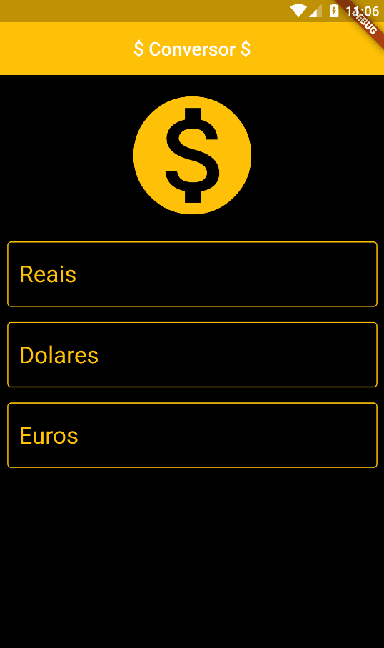

# Conversor de moedas

Projeto desenvolvido durante curso de `Flutter`, com o objetivo de aprender a fazer requisições em apis e utilizar funções futuras com `Dart`.
A api utilizada é diponibilizada pela empresa [HG Brasil](https://hgbrasil.com/status/finance).

### Projeto Finalizado

